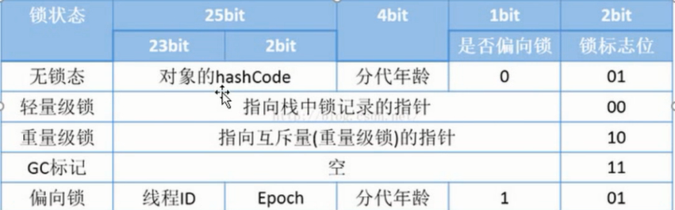

对象的结构
==========

1.	Header（对象头）(32bit)

	-	自身运行时数据：

		-	哈希值
		-	GC分代年龄
		-	锁状态标志
		-	线程持有的锁
		-	偏向线程ID
		-	偏向时间戳

	-	类型指针

		指向类的元数据的指针，hotspot虚拟机通过这个指针来确定该对象是那个类的实例。

> 

2.	InstanceData(实例数据)

3.	Padding

	hotspot虚拟机中对象的起始地址必须是8的整数倍，所以需要填充对齐

对象的访问定位
==============

1.	句柄

	在堆中维护一个句柄池，句柄中包含了对象地址，当对象改变的时候，只需改变句柄，不需要改变栈中本地变量表的引用

2.	直接指针

	对象的地址直接存储在栈中，这样做的好处就是访问速度变快
