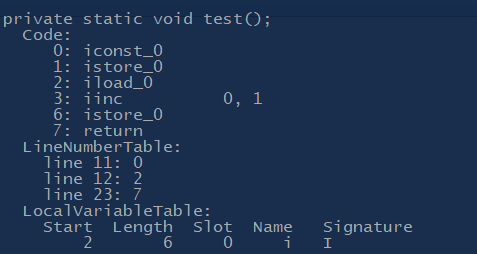

结合字节码分析 i=i++;
=====================


有方法定义如下：

```
private static void test(){
    int i = 0 ;
    i = i++;
}
```

那么执行完后i的值是多少呢？

嗯，当然是0啊，记都记住了，对吧，毕竟是个常见的易错题。

自己做错过一次后就记住了答案，看完解释后也算是懂了，可是过段时间过后，发现自己却忘了怎么来的了。

有的解释是Java中使用了临时变量的机制，`i=i++`等同于：

```
temp=i;
i++;
i=temp;
```

嗯，这样的话结果确实是如此，可是那么为什么等同于上面这三句呢？

反编译一下字节码，看看字节码指令不就好了？

javap 命令用于解析类文件，

常用的参数有

-	-l 输出行以及局部变量表
-	-c 输出类中各方法的未解析的代码，即构成 Java 字节码的指令
-	-verbose 输出堆栈大小、各方法的 locals 及 args 数,以及class文件的编译版本
-	-private 显示所有类以及成员

使用 -c ，-private , -l 选项反编译:

```sbtshell
javap -c -l -private  .\LocalVariableAutoIncrement.class
```

生成的字节码如下 ：



下面一条条的解释指令：

```
0 : iconst_0    将int类型的常量0推送至操作数栈顶
1 : istore_0    将栈顶int类型的变量存入第一个本地变量（位于局部变量表，是一个数组的结构以字长为单位，因为是static方法故在第一个位置即下标0处）
2 : iload_0     将int类型的数值0推送到操作数栈顶
3 : iinc 0,1    将局部变量表索引0处int类型的变量值加一
6 : istore_0    将操作数栈顶的元素存入第一个本地变量（局部变量表中）
```

本地变量的自增操作直接在局部变量表中进行，而最后又将操作数栈顶的元素（原来的值）存入局部变量表中，于是覆盖了之前已经自增的值。<sub>（需要对Java内存模型中虚拟机栈的数据结构有一定了解）</sub>

完整示例代码
------------

[LocalVariableAutoIncrement.java](../../src/main/java/cn/echo0/analyze/LocalVariableAutoIncrement.java)


<small>2017年10月29日</small>